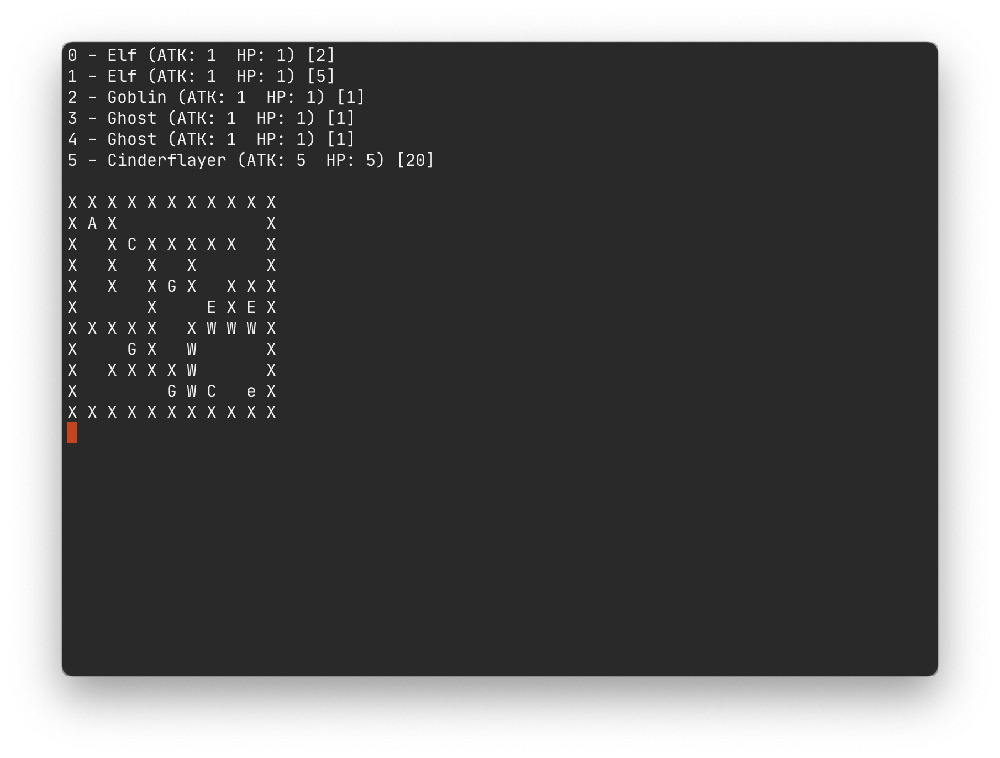
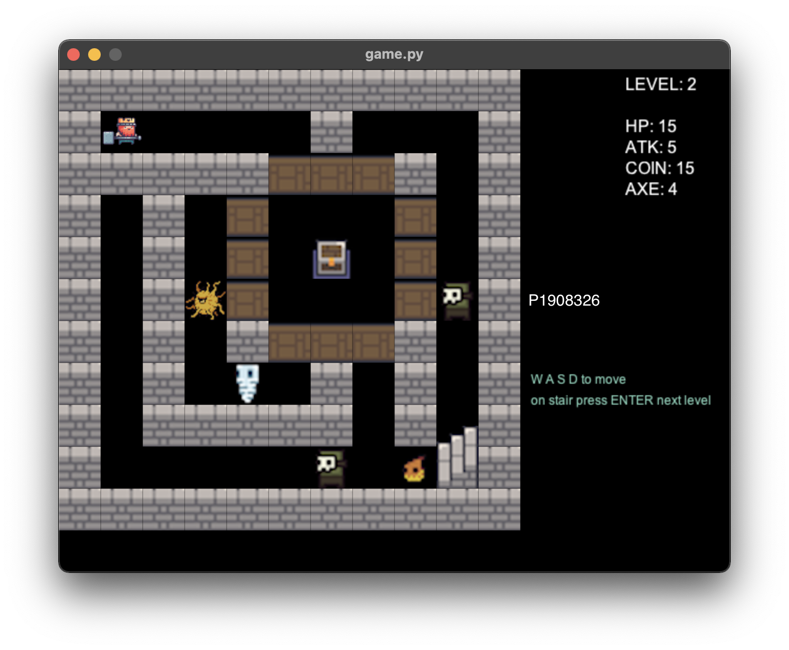
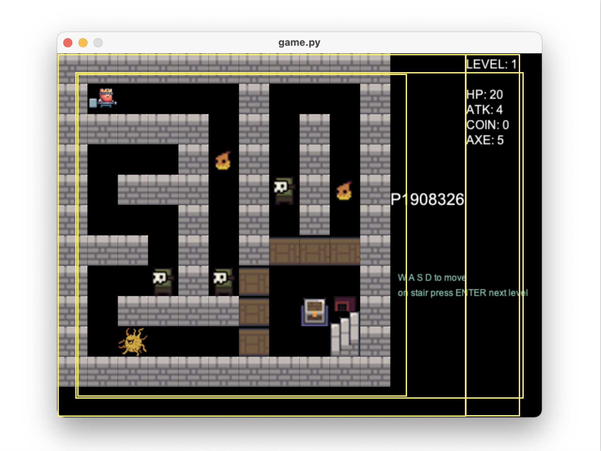
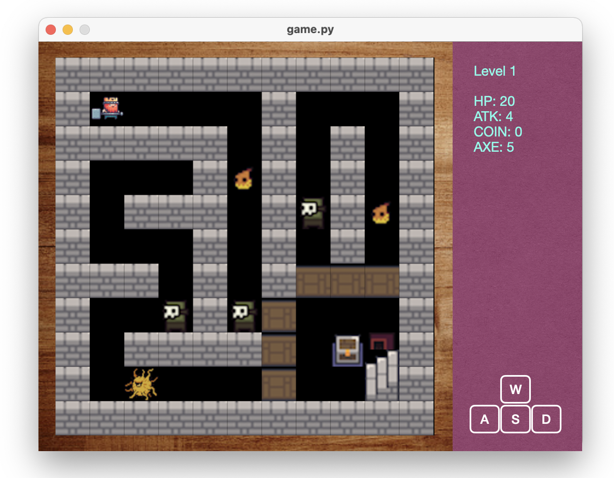
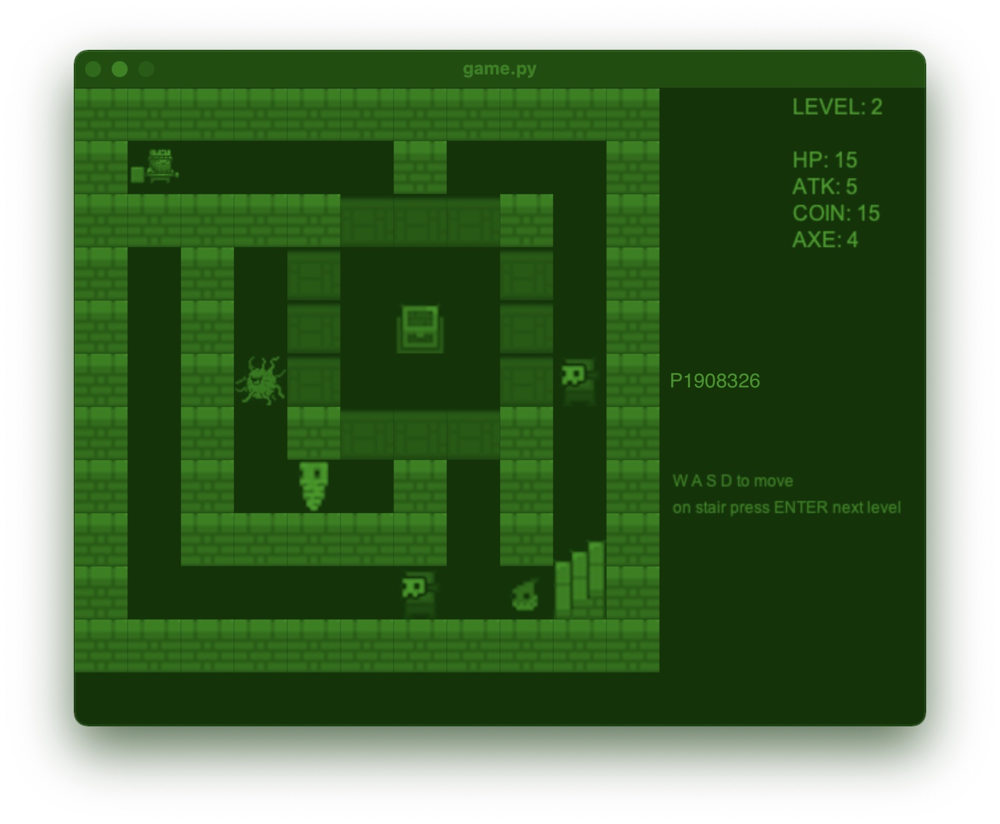
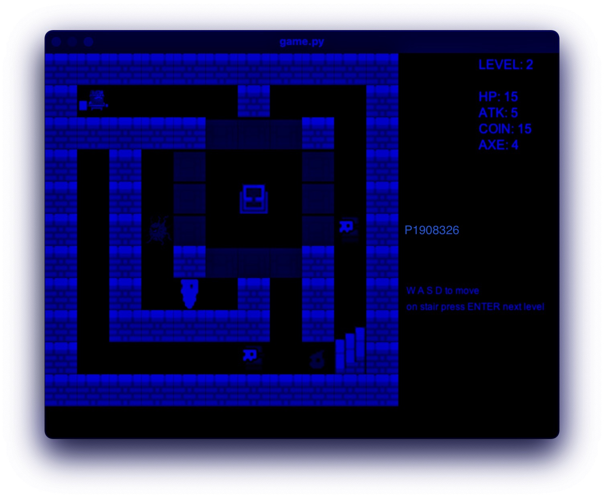
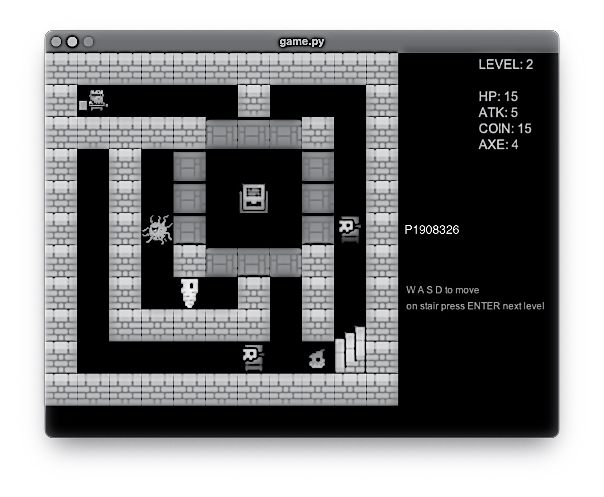

# Report (COMP311 - Assignment 1)

## Introduction

The task of this assignment is to develop a childern oriented game with the assist of multimedia components. I have created my prototype from scratch in Python already in the command line mode as following.

Due to the application of multimedia, I searched from Google and get a result of Python package called "pyglet" (installed by `pip install pyglet`), that is, my first playable release came out.



Moreover, there are some requirements that Professor provided. For a clear reference, here is the table.

| Status | Requirements                                                 | Comment                                                      |
| ------ | ------------------------------------------------------------ | ------------------------------------------------------------ |
| ☑️      | Implement a small game that is suitable for children, such as Joint the Dots, Mastermind and Sokoban. |                                                              |
| ☑️      | The game should be good and beneficial to children, to encourage them to think more. | The game is designed to encourage children to think about the distribution of resources and decision making |
| ☑️      | Different media is expected to be adopted in the game.       |                                                              |
| ☑️      | Any platforms like mobile or flash is acceptable.            | PC (.exe) / Linux and macOS (run from source code)           |
| ☑️      | The game should not have bugs.                               | Not bugs  🐛                                                  |
| ☑️      | In the game interface design, you need to deal with the design issues with knowledge learned. For example, you need to test the tonal contrast. |                                                              |
| ☑️      | You need to submit a report stating the design issues (which covered in Chapter 1) you encountered. |                                                              |
| ☑️      | The game should be deployed, do not simply submit the source code. | Both **src** and click-to-play **exe** is available.         |
| ☑️      | For game that requires plug-ins, you need to submit the plug-ins together with installation instruction written in readme.txt. | No plugins needed.                                           |
| ☑️      | Guideline for playing the game should be given               | [Guideline.md](Guildeline.md)                                |
| ☑️      | All assets in the game could be found from the internet, but the sources should be listed inthe report for copyright issues. | [https://itch.io/game-assets/free](https://itch.io/game-assets/free) |

You can have a look at the Guidelines of how to play around it at next section.


## Guidelines

This Rougelike game is developed by **Steve Yan (P1908326)** for the intention of Assignment 1 in COMP 311 Multimedia Application Development. This instruction contains the Guideline for playing the game.

### Characters

The game is themed on dungeon adventure. Player (act as the King) can break the wooden wall, beat the enimies (, , ) and the boss as well as gain some enhancement from the chests or the merchants.

### Player Properties

There are three dimension of player properties. Respectively, **HP**, **ATK**, **AXE**.

#### HP (Health Point)

Player's initial **HP** is 20, during the battle (When you pass through the enemies) Player's HP will deduct by the **ATK** of that enemy. In addition, the **HP** of that enemy will also deduct by Player's **ATK**.

#### ATK (Attack)

Player's initial **ATK** is 4, calculation method has been explained in **HP Section**.

#### AXE (Number of axe for breaking wooden walls)

Player's initial **AXE** is 5, the **AXE** will deduct by 1 when Player walk through the wooden wall. If the **AXE** is 0, the Player cannot access the wooden wall.

### Merchant

In this game, Merchant is a key NPC that is game changing. The Player should have a wisely decision in store interface in order to be alive for more levels.

### Difficulty

The difficulty of level is gradually increase, which means that the **ATK** and **HP** of enemies will be increase (quantatively by plus (2, 2)). The price of each components in the store is fixed. But the coins that enemy given will not be increase.


## Evolution

### Design Issue

#### **[**Issue#1**]** Choice of programming language

Python is a script programming language, it is good for me to develop the prototype. However, in the deployment stage, I can say that Python is not a good programming language for source code packaging. Actually, on of the core dependencies `pyglet` is second developed from `OpenGL` which is a Open source graph library for C and C++. It is easy to build and compile code in C and C++ program. In addition, if the game is developed in C or C++, the executable file is no larger than 10MB. Unfortunately, I use Python for propotyping and just use it for deeper development due to the limitied time scope. As a consequence, the packaged executable is not available in a small, easy to distribute size. And the packaging process is very slow compared with `g++` compiling command.

#### **[**Issue#2**]** File structure is not standard

Source code of game is not well structured in this project. The 5 files `game.py`, `map.py`, `maze.py`, `name.py`, `npc.py` works dependently to make sure the game run. But not subfolders, just simple python files. The one hand is that the game is not complex enough. On the other hand, is that my file management skills is not mature. So the game project did not have a excellent file structure.

```bash
Permissions Size User     Date Modified Name
drwxr-xr-x     - ex10si0n 30 Oct 15:01  .git/
drwxr-xr-x     - ex10si0n 30 Oct 15:16  assets/
drwxr-xr-x     - ex10si0n 24 Oct 18:27  screenshots/

.rw-r--r--   12k ex10si0n 30 Oct 15:00  game.py
.rw-r--r--  3.8k ex10si0n 23 Oct 14:57  map.py
.rw-r--r--  1.5k ex10si0n 23 Oct 14:41  maze.py
.rw-r--r--  3.2k ex10si0n 23 Oct 11:04  name.py
.rw-r--r--   958 ex10si0n 23 Oct 14:23  npc.py

.rw-r--r--@  374 ex10si0n 30 Oct 14:54  README.md
.rw-r--r--@ 5.6k ex10si0n 30 Oct 15:50  Report.md
.rw-r--r--  1.8k ex10si0n 30 Oct 14:55  Guideline.md
.rw-r--r--    15 ex10si0n 23 Oct 15:36  requirement.txt
```

#### **[**Issue#3**]** (Color&Tone) Hue and brightness need to be modified when the same color is placed against different backgrounds

Although the assets have a border to avoid the color issue when adopting different background color (i.e., it has the black border). If the background is black, just like my game, the border does not work well with the background due to the same color adopted.

#### **[**Issue#4**]** (Layout Grids) The text does not aligned well with layout grids

A layout grid is a geometrical division of the page that can be used to structure the placement of text blocks and images. Alignment can give an appearance of coherence and visual order to a Web page or multimedia interface. The game does not contains a layout girds system. It should be designed and each elements should fit the yellow box. The game map should have a margin leave blank 

The interface should be optimized by adopting the layout gird and it looks nicer. 

#### **[**Issue#5**]** (Semiotics) Using symbols instead of boring words

In the game, users are not easy to recognize the four attributes of player: `HP`, `ATK`, `COIN`, and `AXE`. Instead, if change it to corresponding symbol, it will be vivid and easy to understand by users.


#### **[**Issue#6**]** (Gestalt Principle) Law of Proximity 

The boss in each levels is , but the same size of other enemies and the boss which does not have a obvious warning or mention to the player that the boss will be met in front. Instead, it should be displayed at a larger size to show the unique boss in each levels.

### Tonal Contrast Test

Here are the effects during the test.

For R, G, B channels viewing. The effect is OK.






For grayscale testing, here it is.



We can see that the image is also recognizable while in grayscale format. Hence, the game is availabe for providing accessibility experience.

### Improvements

This project should be improved in several aspects.

#### Code refactor

I should make the source code more structured. In addition, the `assets/` folder should be managed when assets read and write.

#### Change a programming language

Change to C++ with OpenGL is a better choice for improve user experience by distributing a smaller distribution. Besides, I can also implement the Client-Server structure which is famous these years to deploy the game online with the technique of Front-ended programming using JavaScript and Vue solution.

## Conculsion

The game project is difficultly determined when student choice a specific technology stack of development. In this project, I adopted Python to develop the prototype. And use `pyglet` package to develop the user interface. In all, the difficulty of development is not quite hard. However, there are some  problems in developing process, they are mainly in `pyglet` API and variable's scope. In the further evolution of this project, a code refactor is needed. Indeed, the code is not mature enough. I need to imporve the coding structure as well.

Note: Besides the free assets from [https://itch.io/game-assets/free](https://itch.io/game-assets/free). All of this project is done by Steve (P1908326) individually including Algorithm implementation, game developemnt and game concept design. Any similarity is purely coincidental. 
